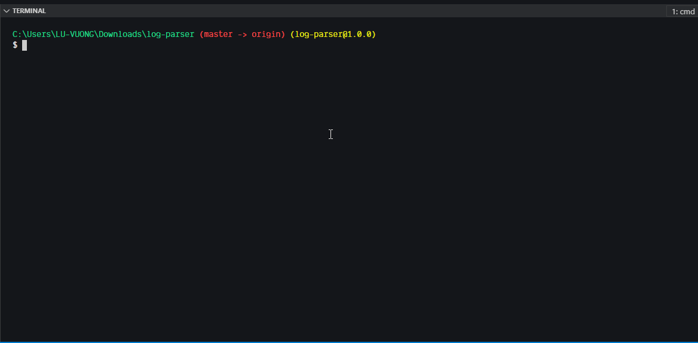

Log Parser Module
==========



Log Parser for HTTP Request log file

[](https://oclif.io)
[](https://npmjs.org/package/log-parser)
[](https://codecov.io/gh/luvuong-le/log-parser-digio)
[](https://npmjs.org/package/log-parser)
[](https://github.com/luvuong-le/log-parser-digio/blob/master/package.json)

* [Tech Stack](#tech-stack)
* [Usage](#usage)
* [Commands](#commands)
* [Testing](#testing)
* [Considerations-Thoughts](#considerations-thoughts)
* [Improvements](#improvements-to-be-made)

# Tech Stack

| Technology | Description                                                                     | Link ↘️                 |
|------------|---------------------------------------------------------------------------------|------------------------|
| JavaScript | High Level, Dynamic, Interpreted Language                                       | ----                   |
| Node JS    | JavaScript Runtime                                                              | https://nodejs.org/en/ |
| oclif   | Open CLI Framework                                                              | https://oclif.io/ |

# Usage

## Local

_Ensure [Node.js](https://nodejs.org/en/) and [NPM](https://www.npmjs.com/) or [Yarn](https://yarnpkg.com/) are installed_

1. Install required dependencies

```
npm install or npm i
```

2. Run the application

```
./bin/run.cmd or ./bin/run 
```

# Commands
* [`log-parser analyse [FILE]`](#log-parser-analyse-file)
* [`log-parser help [COMMAND]`](#log-parser-help-command)

## `log-parser analyse [FILE]`

Analyse log file with HTTP Requests

```
USAGE
  $ log-parser analyse [FILE]

OPTIONS
  -f, --file
  -h, --help       show CLI help
```

_See code: [src\commands\analyse.ts](https://github.com/luvuong-le/log-parser-digio/blob/v0.0.0/src\commands\analyse.ts)_

## `log-parser help [COMMAND]`

display help for log-parser

```
USAGE
  $ log-parser help [COMMAND]

ARGUMENTS
  COMMAND  command to show help for

OPTIONS
  --all  see all commands in CLI
```

_See code: [@oclif/plugin-help](https://github.com/oclif/plugin-help/blob/v3.2.0/src\commands\help.ts)_

# Testing

In order to test, run the following command: 

```
npm run test
```


# Considerations-Thoughts

- While choosing the top 3 active IP addresses or visited urls, there were some that were overlapping. For now, sort and only retrieved the top 3.
- Decided to go with TypeScript for type safety and extensibility in the future if required
- Arrow functions can be refactored if single parameter but oclif ESLint has it's own standards
- Making use of regex named groups to make it easier to group data required
- Could also use split instead of regex to potentially achieve the same result

# Improvements to be made

- Testing coverage could possibly be improved
- Work on cleaning code up further and refactoring more
